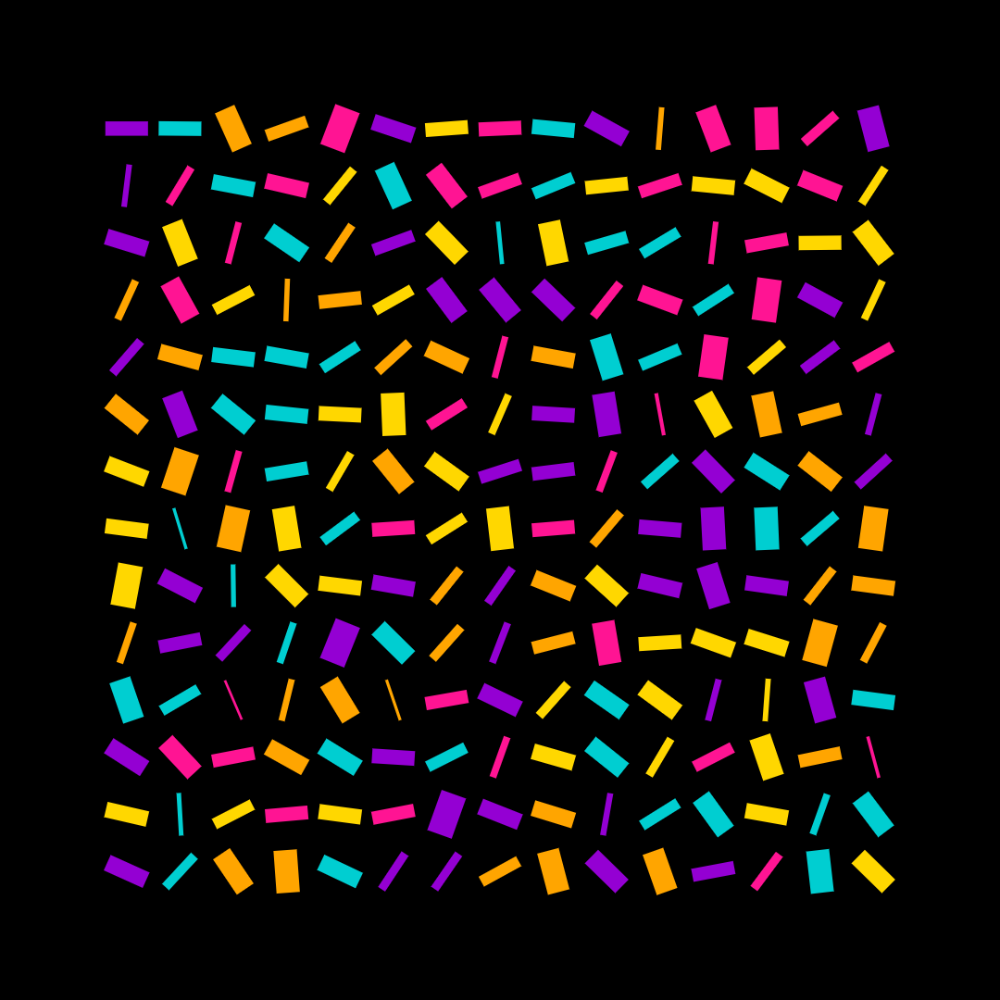
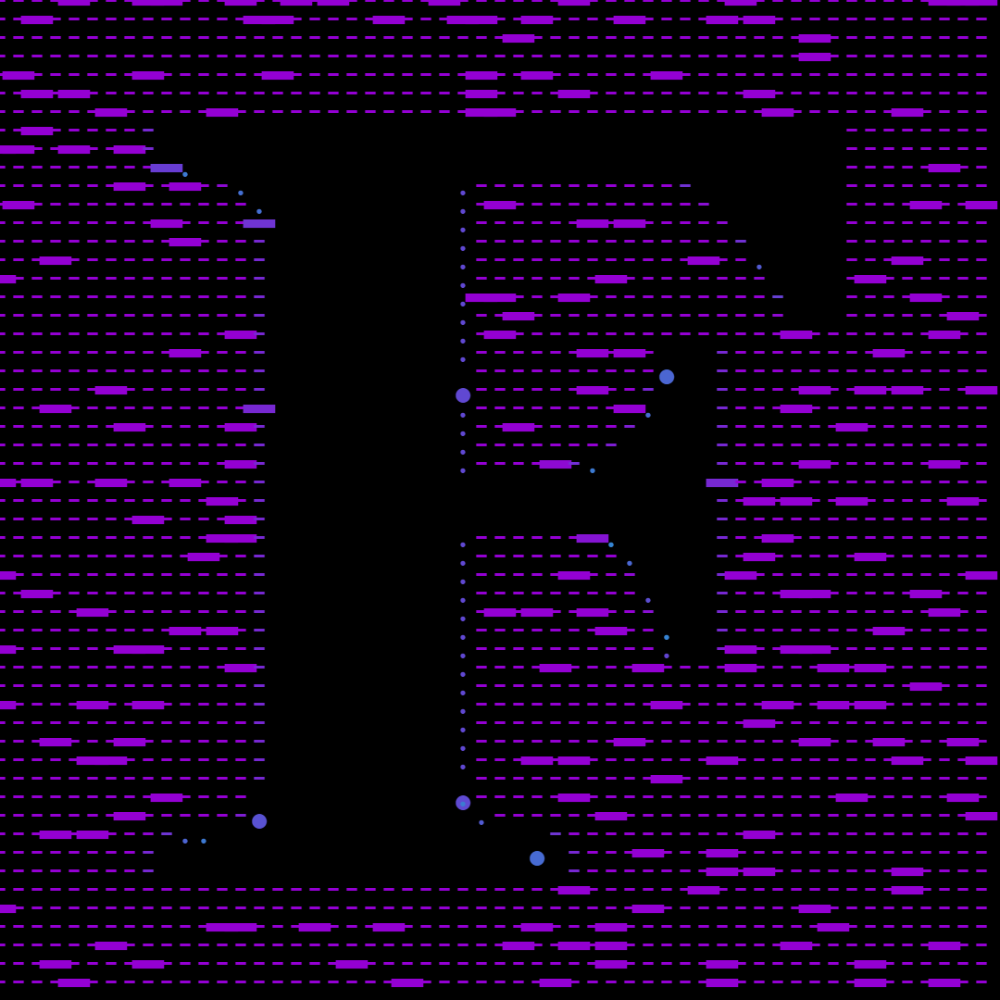
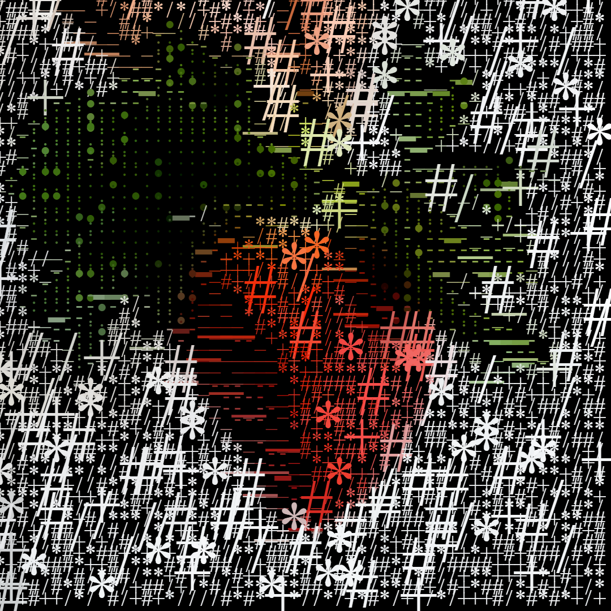

# Creative-Coding

## Making Visuals and motion graphics using the JavaScript language in a creative way.

Based on [Creative Coding: Making Visuals with JavaScript course, by: Bruno Imbrizi](https://www.domestika.org/pt/courses/2729-programacao-criativa-produza-pecas-visuais-com-javascript)

All sketches were made using [canvas-sketch.](https://github.com/mattdesl/canvas-sketch)

- different shapes, lines, points
- images
- noise parameters
- animations
- [tweakpane](https://cocopon.github.io/tweakpane/) - Compact pane library for fine-tuning parameters and monitoring value changes 

Take a look! :smiley:

_sketch-06_

_sketch-08_

_sketch-12_

_sketch-13_

_sketch-13_

